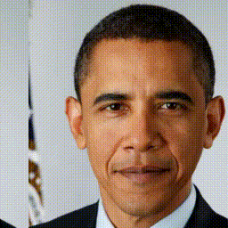
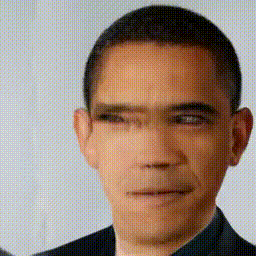
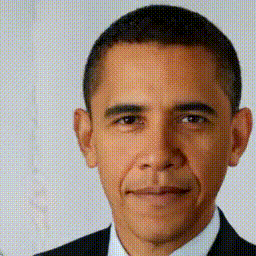

# Toward Spatially Unbiased Generative Models

Implementation of Toward Spatially Unbiased Generative Models (ICCV 2021)

## Overview
Recent image generation models show remarkable generation performance. However, they mirror strong location preference in datasets, which we call **spatial bias**. Therefore, generators render poor samples at unseen locations and scales. We argue that the generators rely on their implicit positional encoding to render spatial content. From our observations, the generator’s implicit positional encoding is translation-variant, making the generator spatially biased. To address this issue, we propose injecting explicit positional encoding at each scale of the generator. By learning the spatially unbiased generator, we facilitate the robust use of generators in multiple tasks, such as GAN inversion, multi-scale generation, generation of arbitrary sizes and aspect ratios. Furthermore, we show that our method can also be applied to denoising diffusion probabilistic models.

### Generation
Original StyleGAN2 | MS-PE + StyleGAN2
:-------------------------:|:-------------------------:
 | 
 | 

### GAN Inversion
Input | Original StyleGAN2 | MS-PE + StyleGAN2
:-------------------------:|:-------------------------:|:-------------------------:
 |  | 

## Requirements

I have tested on:

- PyTorch 1.7

## Usage

### Dataset

Create lmdb datasets:

> python prepare_data.py --out LMDB_PATH --n_worker N_WORKER --size SIZE1,SIZE2,SIZE3,... DATASET_PATH

This will convert images to jpeg and pre-resizes it. This implementation does not use progressive growing, but you can create multiple resolution datasets using size arguments with comma separated lists, for the cases that you want to try another resolutions later.

### Training

> python train.py --name EXPERIMENT_NAME --path LMDB_PATH --position mspe

Set position to "none" for original StyleGAN2.

### Generation

> python generate.py --name EXPERIMENT_NAME --ckpt 550000.pt --truncation 1.0 --position mspe

### GAN inversion

> python projector.py --name EXPERIMENT_NAME --w_plus --ckpt 550000.pt --position mspe ref_face/00006.png 

## Notice
Because the current FFHQ dataset is tightly cropped, we used circular translation for proof-of-concept. Therefore, our samples show reflection artifacts at the boundaries. We are looking forward to training on FFHQ-U from alias-free GAN (https://arxiv.org/abs/2106.12423).

## Acknowledgement

This code rely heavily on: https://github.com/rosinality/stylegan2-pytorch
